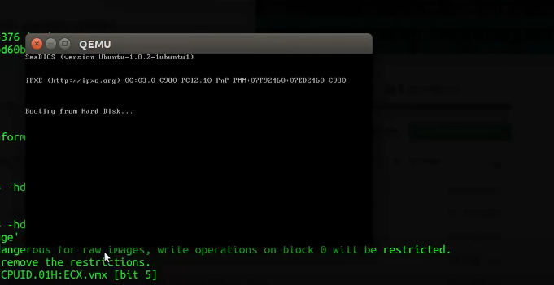
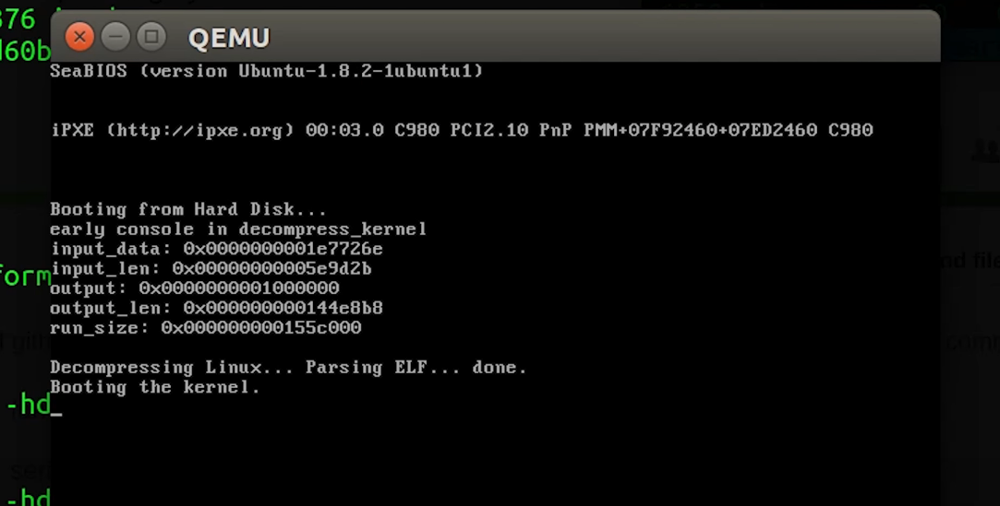
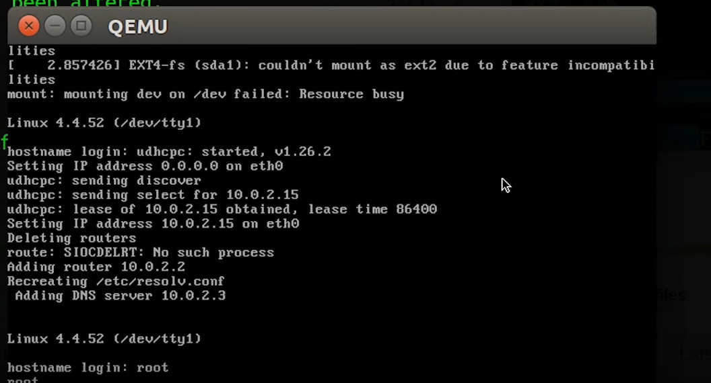

# fridayos :skull: 
an operating system linux based. 

<hr />
<br />
<br />

Okay, first you need to build the linux kernel in order for you to configure it and build your own distro later on. <br />
Check ```LinuxBuild``` directory for an automated build. 


:warning: You don't have to clone nor install the hall kernel since you can automate the build. <br />

<i> Before diving into the installating. Make sure you've got this. </i><br />
```
$ sudo apt-get install build-essential musl-tools grub-pc-bin
```
<i> Now, </i> 
```
$ git clone https://github.com/KMx404/LinuxBuild.git 

$ cd LinuxBuild 
```
<i>Now, after cloning the repository. Lets install what's needed and Go on. </i>

```
$ git submodule init && git submodule update 
 
```
<i> <b> Making an image </b> </i> 
```
make -j image 
```

<i> Running on Emulator (Make sure you've got `Qemu` installed... </i>
```
$ qemu-system-x86_64 -hda image 
``` 






